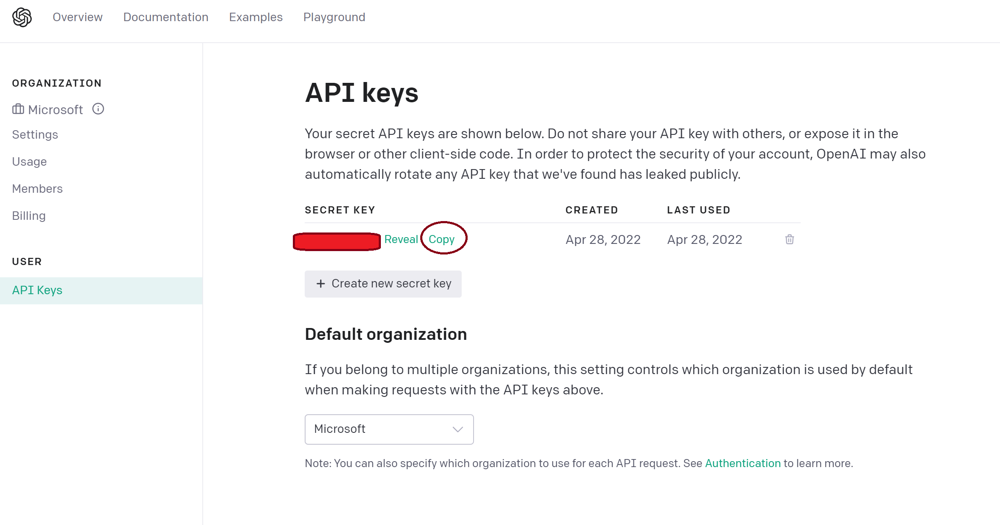
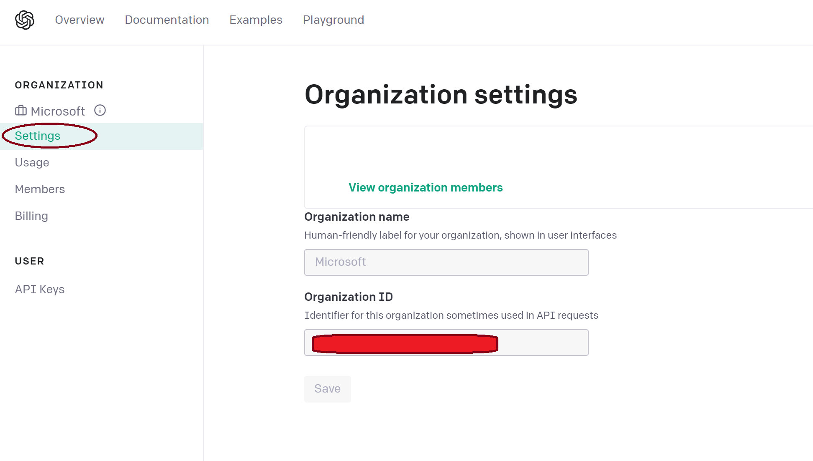
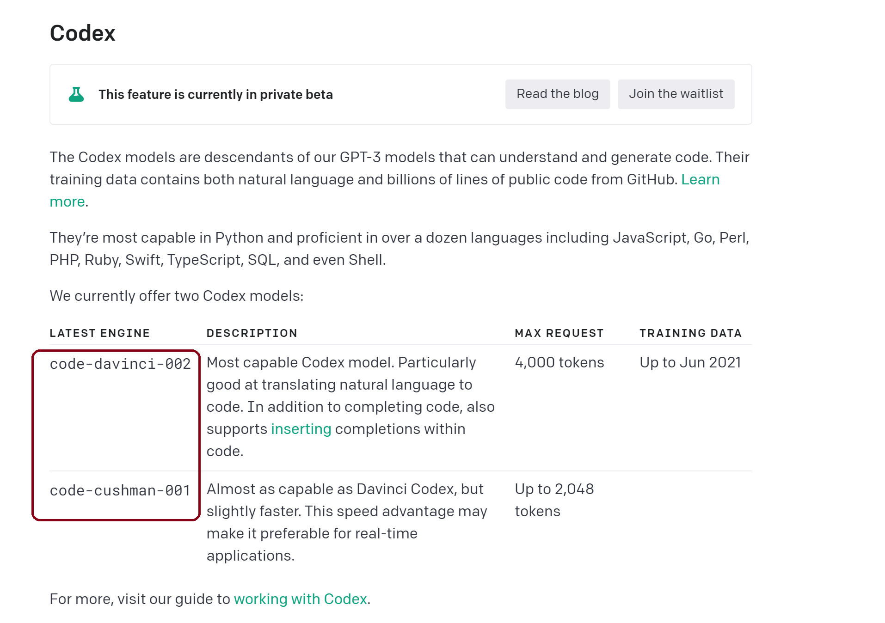
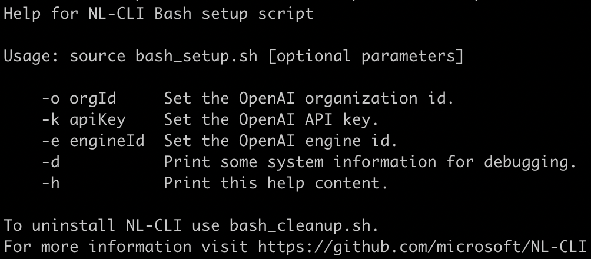

# Codex CLI Installation

In order to leverage the Codex CLI tool, you will need to prepare your environment for the shell of your choice. Installation instructions are shown below for each supported shell environment. 

The following terminal environments are supported:  

* Windows:    [Powershell](#powershell-instructions)
* Linux/WSL:  [Bash](#bash-instructions) 
* Mac OS:     [Zsh](#zsh-instructions) (or [Bash 5.1](#bash-instructions))

## Prerequisites

In order to run the Codex CLI, ensure that you have python installed. To install the required python packages, please go to the command line in the shell of your choice and enter the following commands: 

```
python -m pip install -r requirements.txt
```

Additionally, the OpenAI API key, organization id, and engine id are required to execute the Codex CLI tool. 

To obtain the OpenAI API key information, go to (https://beta.openai.com/account/api-keys) and login into your account. 

Once logged in you will see: 


Copy the API key by clicking the _Copy_ button and save the copied key where you can retrieve it.

To obtain the OpenAI organization id, go to OpenAI Settings page (https://beta.openai.com/account/org-settings) and copy the id shown underneath the _Organization ID_ heading. Save the copied id with the API key that was stored in previous step. 

See image below for reference: 


To obtain the OpenAI engine id, go to OpenAI Engines page (https://beta.openai.com/docs/engines/codex-series-private-beta) for the engines available for Codex models. Select the desired engine and save the engine id with the API key and organization id stored in previous steps. 

See image below for reference: 


## Bash instructions

To leverage the Codex CLI on WSL and Linux environments using Bash please follow the steps below: 

1. Open Bash shell and download the Codex CLI project to your desired location in Linux by cloning the Codex CLI repo using the following command: 
    ```
    $ git clone https://github.com/microsoft/Codex-CLI.git /your/custom/path/
    ```

2. Once you have the project cloned. Go to the directory that contains the Codex CLI code.
    ```
	cd </your/custom/path>/Codex-CLI
    ```

3. Setup your Bash Codex CLI environment.

	In the Codex CLI folder, there is a folder named `scripts` where you will find a `bash_setup.sh` script which is used to setup the Bash environment.

	Run the following commands to setup your environment, the script will prompt
	for Organization id, API key and engine id:
	```
	cd scripts
	source bash_setup.sh
	```
	
	The script will create an OpenAI config file and update your bash environment.

4. Open a new Bash terminal. Type in `#` followed by your natural language request. Press Ctrl+g to execute!

### Clean up

Once you have finished using the Codex CLI tool, go to the folder that contains the Codex CLI code. ex `cd ~/your/custom/path/Codex-CLI`. Run the following command to clean up the Codex CLI bash environment.
```
source ./scripts/bash_cleanup.sh
```
Once done, close the terminal session.

### About bash_setup.sh

By default `bash_setup.sh` will prompt for the required settings. It's also possible to pass these values from the command line, using the following parameters:

| Parameter    | Description |
|--------------|-------------|
| `-o <value>` | To pass your [OpenAI Organization Id](https://beta.openai.com/account/org-settings) |
| `-k <value>` | To pass your [OpenAI API key](https://beta.openai.com/account/api-keys) |
| `-e <value>` | To specify the [OpenAI Engine Id](https://beta.openai.com/docs/engines/codex-series-private-beta) |

Example: 

```
source bash_setup.sh -o myorgid -k myapikey -e someengineid
```

For help running the Codex CLI Bash setup, please run the following command:   
```
source bash_setup.sh -h
```



## Zsh instructions

1. Download this project to `~/your/custom/path/`.

```
    $ git clone https://github.com/microsoft/Codex-CLI.git ~/your/custom/path/
```

2. In zsh, go to `~/your/custom/path/` (the folder contains Codex CLI code), then run the following command to setup your zsh environment. The script will prompt for Organization id, API key and engine id:

```
./scripts/zsh_setup.sh
```
&nbsp;&nbsp;&nbsp;&nbsp;&nbsp;&nbsp;&nbsp;&nbsp;&nbsp;&nbsp;See [About zsh_setup.sh](#about-zshsetupsh) section to learn script parameters.

3. Run `zsh`, start typing and complete it using `^G`!

### Clean up
Once you are done, go to `~/your/custom/path/` (the folder contains Codex CLI code), then run the following command to clean up.
```
./scripts/zsh_cleanup.sh
```

### About zsh_setup.sh
`zsh_setup.sh` supports the following parameters:
| Parameter    | Description |
|--------------|-------------|
| `-o <value>` | To pass your [OpenAI Organization Id](https://beta.openai.com/account/org-settings) |
| `-k <value>` | To pass your [OpenAI API key](https://beta.openai.com/account/api-keys) |
| `-e <value>` | To specify the [OpenAI Engine Id](https://beta.openai.com/docs/engines/codex-series-private-beta) |


## Powershell instructions

1. Download this project to wherever you want `C:\your\custom\path\`.

```
    $ git clone https://github.com/microsoft/Codex-CLI.git C:\your\custom\path\
```

2. Open PowerShell as Administrator and run the following command.

```
Set-ExecutionPolicy RemoteSigned -Scope CurrentUser
```


3. In the same Powershell window, go to `C:\your\custom\path\Codex-CLI\` (the folder contains Codex CLI code). Copy the following command then replace `YOUR_OPENAI_ORGANIZATION_ID` and `ENGINE_ID` with your OpenAI organization Id and OpenAI engine Id. Run the command to setup your PowerShell environment. It will prompt you for OpenAI access key.

```
.\scripts\powershell_setup.ps1 -OpenAIOrganizationId "YOUR_OPENAI_ORGANIZATION_ID" -OpenAIEngineId "ENGINE_ID"
```
&nbsp;&nbsp;&nbsp;&nbsp;&nbsp;&nbsp;&nbsp;&nbsp;&nbsp;&nbsp;See [About powershell_setup.ps1](#about-powershell_setupps1) section to learn script parameters.

4. Open a new PowerShell session, type in `#` followed by your natural language command and hit Ctrl + G!

### Clean up
Once you are done, go to `C:\your\custom\path\` (the folder contains Codex CLI code), then run the following command to clean up.
```
.\scripts\powershell_cleanup.ps1
```

If you want to revert the execution policy, run this command
```
Set-ExecutionPolicy Undefined -Scope CurrentUser
```

### About powershell_setup.ps1
`powershell_setup.ps1` supports the following parameters:
| Parameter | Type | Description |
|--|--|--|
| `-OpenAIApiKey` | [SecureString](https://docs.microsoft.com/en-us/dotnet/api/system.security.securestring) | Required. If is not supplied, the script will prompt you to input the value. You can find this value at [https://beta.openai.com/account/api-keys](https://beta.openai.com/account/api-keys). To provide the value via PowerShell parameter, this is an example for PowerShell 7: <br/> `.\scripts\powershell_setup.ps1 -OpenAIApiKey (ConvertTo-SecureString "YOUR_OPENAI_API_KEY" -AsPlainText -Force)` | 
| `-OpenAIOrganizationId` | String | Required. Your [OpenAI organization Id](https://beta.openai.com/account/org-settings). |
| `-OpenAIEngineId` | String | Required. The [OpenAI engine Id](https://beta.openai.com/docs/engines/codex-series-private-beta) that provides access to a model.|
| `-RepoRoot` | [FileInfo](https://docs.microsoft.com/en-us/dotnet/api/system.io.fileinfo) | Optional. Default to the current folder.<br>The value should be the path of Codex CLI folder. Example:<br/>`.\scripts\powershell_setup.ps1 -RepoRoot 'C:\your\custom\path'`|
